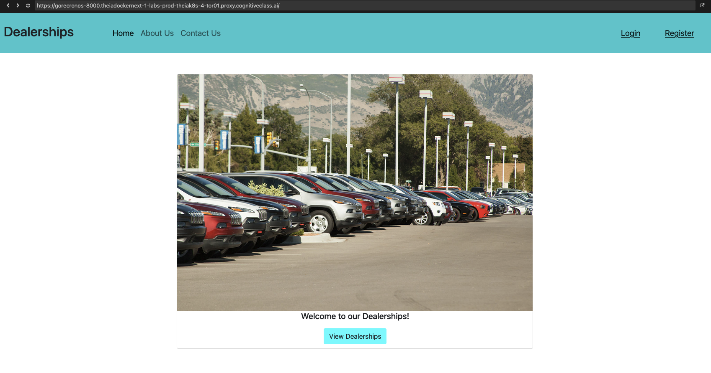
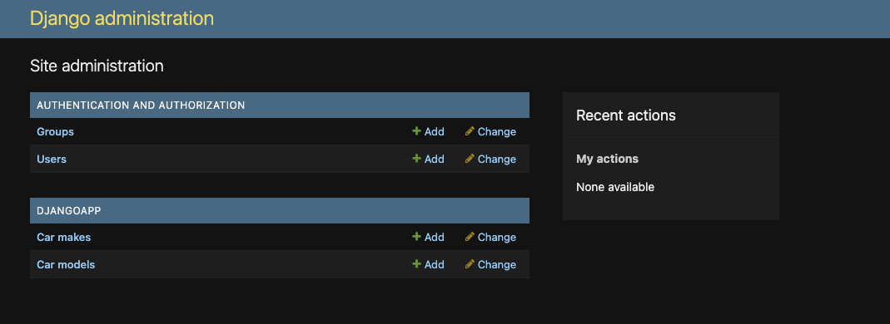
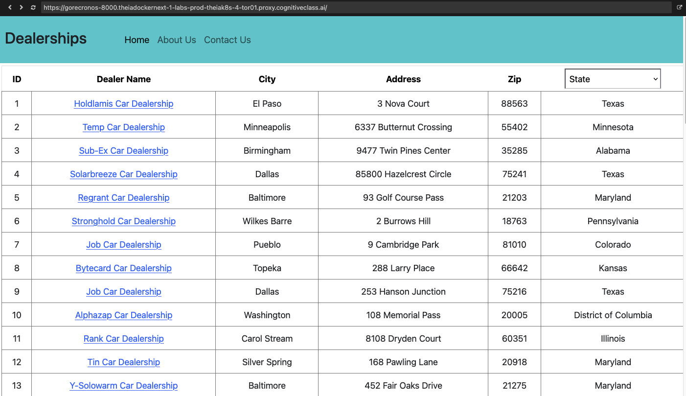
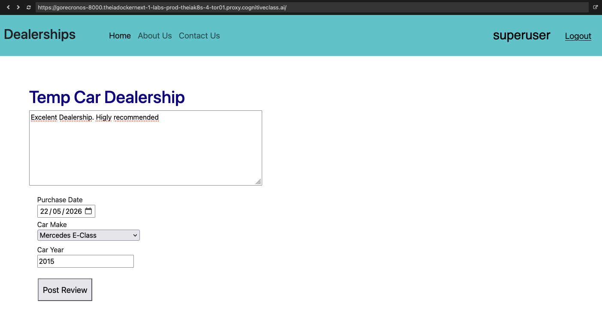
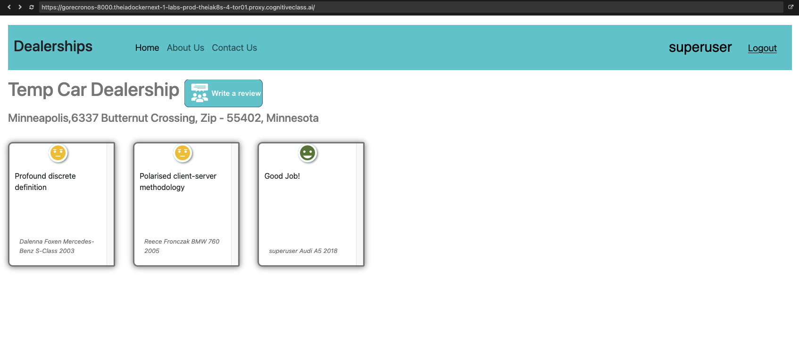

[Volver al README principal](README.md) | [Read in English](README_en.md)

# Full Stack Application Development Project

Aplicación full-stack de reseñas para concesionarios de coches, creada como
proyecto de aprendizaje a partir del curso de IBM **Full Stack Application
Development Project** en edX.

La aplicación permite explorar concesionarios, filtrarlos por estado, abrir el
detalle de un vendedor, registrarse o iniciar sesión, subir reseñas y ver un
marcador automático de satisfacción/sentimiento para cada reseña.

<p align="center">
  
</p>

## Tabla de Contenidos

- [Sobre el Proyecto](#sobre-el-proyecto)
- [Funcionalidades](#funcionalidades)
- [Arquitectura](#arquitectura)
- [Capturas](#capturas)
- [Tecnologías](#tecnologías)
- [Estructura del Proyecto](#estructura-del-proyecto)
- [Configuración Local](#configuración-local)
- [Endpoints Útiles](#endpoints-útiles)
- [Autor](#autor)
- [Licencia](#licencia)

## Sobre el Proyecto

Este repositorio está basado en material de IBM Developer Skills Network para el
curso de edX:

[Full Stack Application Development Project](https://www.edx.org/learn/full-stack-development/ibm-full-stack-application-development-project?index=rv_product_summary&queryId=77288f71350e59e3061c194489b4387e&position=1)

El proyecto está organizado como una aplicación con varios servicios:

- Django gestiona el backend principal, autenticación, panel de administración,
  páginas estáticas y rutas API.
- React proporciona la interfaz interactiva de concesionarios, login, registro y
  subida de reseñas.
- Express expone los datos de concesionarios y reseñas almacenados en MongoDB.
- Flask ofrece el análisis de sentimiento de las reseñas usando NLTK/VADER.

## Funcionalidades

- Páginas Home, About y Contact servidas por Django.
- Registro, login, logout y acceso a reseñas mediante sesión.
- Panel de administración de Django.
- Listado de concesionarios con filtro por estado.
- Página de detalle de cada vendedor con sus reseñas.
- Formulario de reseña para usuarios autenticados.
- Datos de marcas y modelos de coches poblados desde modelos Django.
- Clasificación automática de sentimiento: positivo, neutral o negativo.
- Datos iniciales de concesionarios y reseñas cargados en MongoDB.

## Arquitectura

```text
Interfaz React
  |
  v
Aplicación Django
  |-- SQLite: usuarios Django y modelos de coches
  |-- API Express: concesionarios y reseñas
  |-- Servicio Flask: análisis de sentimiento

API Express
  |
  v
MongoDB
```

Puertos por defecto:

| Servicio | Ruta | Puerto |
| --- | --- | --- |
| Aplicación Django | `server/` | `8000` |
| Aplicación React | `server/frontend/` | `3000` |
| API Express/Mongo | `server/database/` | `3030` |
| Servicio Flask de sentimiento | `server/djangoapp/microservices/` | `5050` |
| MongoDB | Servicio Docker | `27017` |

## Capturas

<h3 align="center">Login de Administrador</h3>

<p align="center">
  
</p>

<h3 align="center">Home</h3>

<p align="center">
  
</p>

<h3 align="center">Obtención de Vendedores</h3>

<p align="center">
  
</p>

<h3 align="center">Subida de Reseña</h3>

<p align="center">
  
</p>

<h3 align="center">Detalle del Vendedor con Sentimiento</h3>

<p align="center">
  
</p>

## Tecnologías

- Python
- Django
- React
- JavaScript
- Node.js
- Express
- MongoDB
- Flask
- Análisis de sentimiento con NLTK/VADER
- Docker y Docker Compose
- SQLite

## Estructura del Proyecto

```text
.
|-- images/                         # Capturas del proyecto
|-- server/
|   |-- djangoapp/                   # App Django, vistas, URLs, modelos y helpers API
|   |   |-- microservices/            # Analizador de sentimiento en Flask
|   |-- djangoproj/                  # Settings y URLs principales de Django
|   |-- database/                    # API Express, modelos Mongo, datos JSON y Docker
|   |-- frontend/                    # Aplicación React
|   |-- manage.py
|   |-- requirements.txt
|-- LICENSE
|-- README.md
|-- README_en.md
|-- README_es.md
```

## Configuración Local

El proyecto tiene varios servicios. Ejecuta cada uno en una terminal diferente.

### 1. Entorno Python del Backend

```bash
cd server
python -m venv venv
source venv/bin/activate
pip install -r requirements.txt
```

### 2. Construir el Frontend React

```bash
cd server/frontend
npm install
npm run build
```

Para usar React en modo desarrollo:

```bash
cd server/frontend
npm start
```

### 3. Iniciar MongoDB y la API Express

```bash
cd server/database
npm install
docker build -t nodeapp .
docker compose up
```

La API Express queda disponible en `http://localhost:3030`.

### 4. Iniciar el Microservicio de Sentimiento

```bash
cd server/djangoapp/microservices
pip install -r requirements.txt
flask run --host=0.0.0.0 --port=5050
```

El helper de Django espera el analizador de sentimiento en
`http://localhost:5050/` por defecto.

### 5. Iniciar Django

```bash
cd server
python manage.py migrate
python manage.py createsuperuser
python manage.py runserver
```

Abre `http://localhost:8000`.

Opcionalmente, puedes definir variables de entorno en `server/djangoapp/.env`:

```env
backend_url=http://localhost:3030
sentiment_analyzer_url=http://localhost:5050/
```

## Endpoints Útiles

### Django

| Endpoint | Descripción |
| --- | --- |
| `/` | Página Home |
| `/admin/` | Panel de administración de Django |
| `/djangoapp/register` | Registrar usuario |
| `/djangoapp/login` | Iniciar sesión |
| `/djangoapp/logout` | Cerrar sesión |
| `/djangoapp/get_dealers` | Obtener todos los concesionarios |
| `/djangoapp/get_dealers/<state>` | Obtener concesionarios por estado |
| `/djangoapp/dealer/<dealer_id>` | Obtener detalle del vendedor |
| `/djangoapp/reviews/dealer/<dealer_id>` | Obtener reseñas con sentimiento |
| `/djangoapp/add_review` | Enviar una reseña |
| `/djangoapp/get_cars` | Obtener marcas y modelos de coches |

### API Express

| Endpoint | Descripción |
| --- | --- |
| `/fetchDealers` | Obtener todos los concesionarios |
| `/fetchDealers/:state` | Obtener concesionarios por estado |
| `/fetchDealer/:id` | Obtener un vendedor |
| `/fetchReviews` | Obtener todas las reseñas |
| `/fetchReviews/dealer/:id` | Obtener reseñas de un vendedor |
| `/insert_review` | Insertar una nueva reseña |

## Autor

- LinkedIn: [linkedin.com/in/raulesteveza](https://www.linkedin.com/in/raulesteveza/)
- Web: [raulesteveza.github.io](https://raulesteveza.github.io)
- GitHub: [github.com/RaulEstevezA](https://github.com/RaulEstevezA)

## Licencia

Este repositorio mantiene el aviso de licencia original de IBM Developer Skills
Network. El proyecto está distribuido bajo Apache License 2.0. Consulta
[LICENSE](LICENSE) para ver el texto completo.
